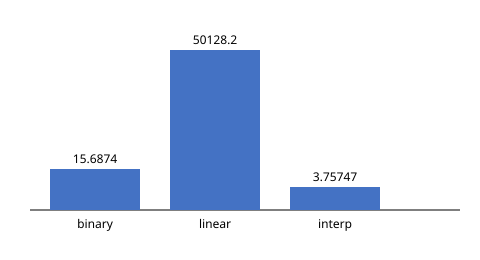

# optimal-search-strategies


Empirically verifying information-theoretic lower bounds on search strategies
-- and checking each claim against real data instead of just asserting it.

## Results at a glance



100k trials, range size 100,000, seed 1. Bars are log-scaled (linear scan's
mean is ~13,000x the other two -- on a linear axis they round to invisible),
but the numbers printed above each bar are the real, unscaled means.
Generated with `./guess simulate --min 1 --max 100000 --trials 100000 --seed 1 --svg monte_carlo_chart.svg`.

## What this does

Starts from a simple question: is binary search's `ceil(log2 N)` worst case
actually optimal? The answer turns out to be "only under specific
assumptions" -- and this repo makes each of those assumptions explicit,
then tests where they break.

```
./guess play                                        # you guess, computer thinks of a number
./guess demo                                         # computer guesses your number
./guess simulate --min 1 --max 100000 --trials 100000 --seed 1
```

`simulate` runs binary search, linear scan, and interpolation search against
random secrets, checks the measured worst case against the theoretical
bound (failing loudly with a non-zero exit code if they ever disagree), and
reports a 95% confidence interval and a chi-square check on the RNG's
uniformity. It also runs binary search, a greedy entropy-optimal heuristic,
and Knuth's DP-optimal BST head-to-head under a skewed (Zipf) prior (the
DP is capped at N=2000; it's O(N^2) time and space, and this program's
usual range sizes would exhaust memory). Add `--json` for machine-readable
output or `--svg chart.svg` for a bar chart (native C++, no external
plotting library).

## The math

Searching a space of $N$ equally likely values means resolving $\log_2 N$
bits of uncertainty. Each yes/no query can reveal at most 1 bit, so no
decision procedure can beat $\lceil \log_2 N \rceil$ queries in the worst
case -- this is what `informationTheoreticLowerBound` computes, and what
`simulate` checks binary search against on every run.

Under a non-uniform prior $p$, the same idea generalizes: the Shannon
entropy

$$H(p) = -\sum_i p_i \log_2 p_i$$

is the minimum *expected* number of yes/no queries needed, for any valid
decision procedure, not just this one. `runWeightedComparison` checks
binary search, a greedy entropy-optimal heuristic, and Knuth's DP-optimal
BST against this exact bound under a Zipf-distributed prior.

## Bugs this project found

Five real bugs surfaced while building and testing this, not while writing
the original code -- each caught by an assertion, a test, or a sanity check
actually firing, not by inspection:

- **Off-by-one in the bound formula.** `ceil(log2 N)` is wrong at every
  exact power of two; the correct formula is the smallest `k` such that
  `2^k >= N+1`. Invisible with the old hardcoded default of N=100 (not a
  power of two); surfaced once N was parameterized and tested exhaustively
  at {1,2,4,8,...,128}, wrong at every single one.
- **Interpolation search degenerated to a no-op.** Running interpolation
  search directly on scalar `[lo, hi]` range bounds instead of a real
  sampled array made its midpoint formula algebraically collapse to
  `mid = secret` -- it "found" the target on the first query almost every
  time. Fixed by searching an actual sorted array; measured mean went from
  a fake `1.0` to a real `~3.76` (matching the expected `O(log log N)`).
- **RNG seeding was a silent no-op waiting to happen.** The RNG's seed was
  folded into a static local's default argument, which only takes effect on
  the very first call to that function -- any other code path calling it
  first would silently swallow `--seed` with no warning. Fixed by
  separating initialization from retrieval.
- **Signed integer overflow at extreme ranges.** The bound calculation's
  bit-shifting was done in `long long`; an extreme `--max` (e.g.
  `LLONG_MAX`) triggers signed overflow, undefined behavior. Fixed with
  unsigned arithmetic.
- **A yes/no vs. 3-way cost-model mismatch, caught mid-build.** Bridging
  Knuth's optimal BST into the entropy comparison initially measured it
  under Knuth's classical 3-way (early-exit-on-match) cost, then printed it
  next to strict yes/no query counts. Result: Knuth's mean landed *below*
  the Shannon bound `H(p)` -- mathematically impossible for a real yes/no
  procedure. Fixed by deriving a yes/no-consistent traversal from Knuth's
  split points instead, with a test guarding against the regression.

## What's actually verified, not just claimed

- **Binary search's worst case matches the (corrected) bound exactly**,
  asserted with a real pass/fail exit code, not just printed for inspection.
- **Interpolation search's O(log log N) win on uniform data** and its
  **adversarial collapse toward O(N)** on a constructed Fibonacci-spaced
  array -- both measured, not asserted.
- **Entropy-optimal search and Knuth's DP-optimal BST both beat plain binary
  search under a skewed prior**, and both are checked against the Shannon
  entropy lower bound `H(p)` using a matched yes/no query model (see "Bugs
  this project found" above for why that match matters).
- **The RNG's uniformity** via chi-square test, and **reproducibility** via
  `--seed`, verified with byte-identical output across separate process
  launches.

## Build

```
g++ -std=c++17 -Wall -Wextra number_guessing_game.cpp -o guess
g++ -std=c++17 -Wall -Wextra -fsanitize=address,undefined tests.cpp -o tests
g++ -std=c++17 -Wall -Wextra knuth_optimal_bst.cpp -o knuth_bst  # standalone worked example
./tests
```

Or with CMake: `cmake -B build && cmake --build build` (defaults to Release;
pass `-DCMAKE_BUILD_TYPE=Debug` to build `tests` with ASan/UBSan attached).

## Reading the history

Each commit is a single, atomic change -- compiled and tested before being
committed, not written after the fact. The commit messages explain the
*why* behind each change, including the bugs listed above, most of which
were caught by the testing infrastructure itself rather than planned in
advance. `git log -p` tells that story in order.
